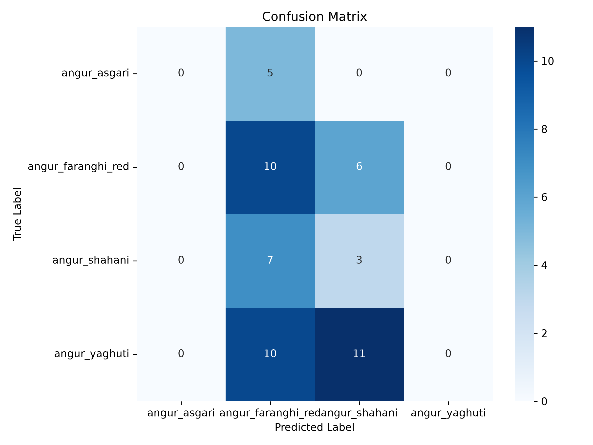
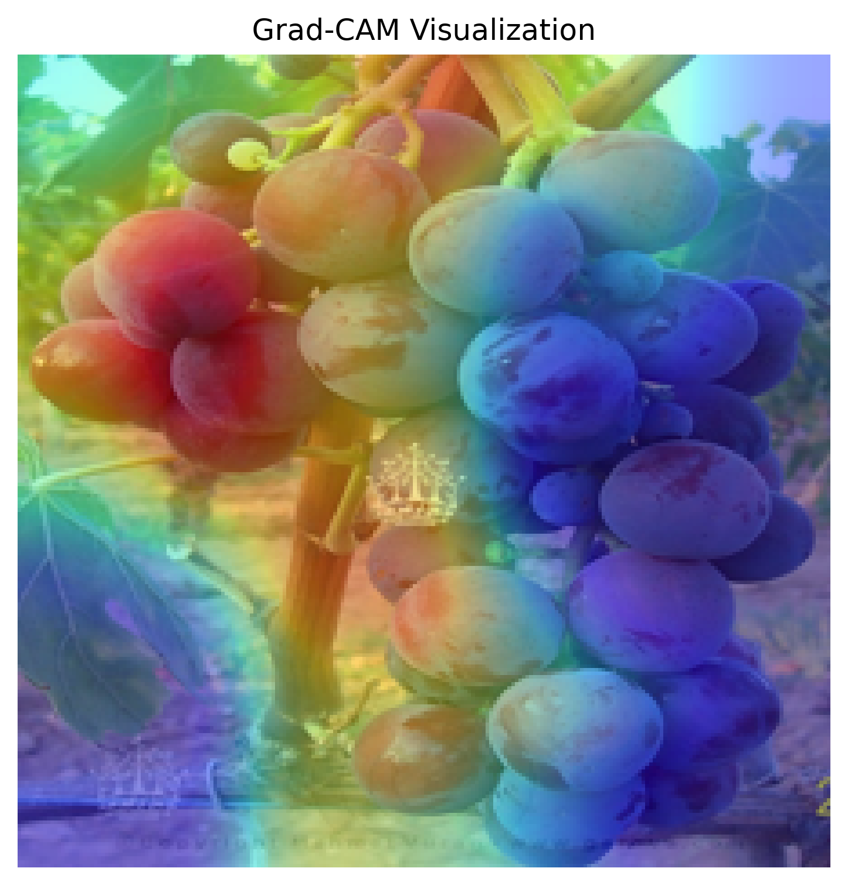

# Grape Variety Classification & Explainable AI (XAI)


An end-to-end Deep Learning project designed to classify four distinct grape leaf varieties (**Asgari, Yaghooti, Shahani, Farangi**) with high precision. This project showcases the evolution from a baseline ANN to a lightweight, high-performance **MobileNetV2** architecture using Transfer Learning and Fine-Tuning.

## 🚀 Key Features
- **Transfer Learning:** Leveraging ImageNet pre-trained weights via MobileNetV2 for feature extraction.
- **Fine-Tuning:** Unfreezing top layers to specialize the model for horticultural nuances.
- **Explainable AI (XAI):** Integrated **Grad-CAM** (Gradient-weighted Class Activation Mapping) to visualize which parts of the leaf the model "looks at" during prediction.
- **Interactive Web UI:** A professional Streamlit dashboard for real-time inference and heatmap visualization.
- **Robust Evaluation:** Comprehensive metrics including Confusion Matrices and detailed Classification Reports.

---

## 📊 Results & Explainability

### Model Evaluation
The model achieved high accuracy across all four classes. The confusion matrix below illustrates the model's ability to distinguish between similar leaf structures with minimal cross-entropy loss.



### Explainable AI (Grad-CAM)
To ensure the model is focusing on biological markers rather than background noise, we implemented Grad-CAM. This provides a transparency layer, highlighting the neural network's focus areas.


*Left: Original Image | Center: Heatmap | Right: Overlay*

---

## 📂 Project Structure
```text
├── assets/                 # Test images and static branding
├── dataset/                # Raw image data (organized by variety)
├── evaluation/             # Generated plots (CM, Grad-CAM, Architecture)
│   ├── confusion_matrix.png
│   ├── gradcam_result.png
│   └── model_architecture.png
├── models/                 # Serialized weights and metadata
│   ├── grape_model_finetuned_final.h5
│   └── class_names.npy
├── src/                    # Source code modules
│   ├── train_model.py      # Transfer learning & fine-tuning pipeline
│   ├── predict.py          # Decoupled inference engine
│   ├── evaluate_model.py   # Metric generation and CM plotting
│   ├── gradcam.py          # XAI implementation logic
│   └── visualize_model.py  # Keras plot_model utilities
├── app.py                  # Streamlit Web Application
├── requirements.txt        # Dependency manifest
└── run_app.bat             # Windows execution script